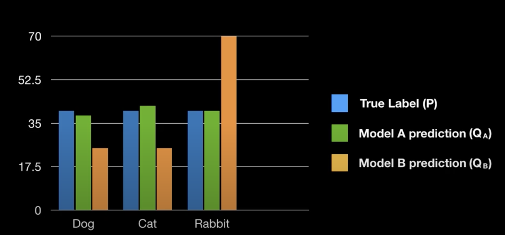

# 엔트로피
- 정보를 표현하는데에 있어서 필요한 최소 평균 자원 량
- 어떻게 코딩(허프만 코드)을 해도 이거보다 낮게, 짧게 코딩할 수 없다.
- Average Coding Length의 Lower Bound
- 1만나오는 주사위(균등한 확률, 주사위)는 안알려줘도 그만이기 때문에 정보량이 낮다.
- 유니폼 random variable이 엔트로피가 가장 크다.
## 정보를 어떻게 표현하는가?
- 0또는 1로 표현

## 최소 자원량
- bit의 단위
- 확률이 1에 가까우면 bit길이를 자주 등장하는 것이기 때문에 bit길이를 짧게 표현한다.

# 왜 엔트로피는 $ H(X) = - \sum_{i = 1}^{n}p(x_i)logp(x_i) $ 형태인가

- 당연하다 = 사건의 확률이 높다 = 정보량이 낮다.
- 뻔하지 않은 이야기는 정보량이 크다.

## 정보량
- 놀람의 정도

X의 정보량 h(x) 는 p(x)에 대한 함수
해가 동쪽에 뜰 확률 $ p(east) = 0.999999 $, 서쪽에 뜰 확률 $ p(west) = 1 $이다. 따라서 $ h(west) > h(east) $이다.

---

확률 변수 X,Y  
1. X는 East,West 두 가지
2. Y는 Rain, Not Rain 두가지
3. X,Y는 독립
정보 2개가 있을 때 우리가 얻을 수 있는 정보는 $ h(x,y) = h(x) + h(y) $ 로 표현할 수 있다.  
정보 2개가 있을 때 우리가 얻을 수 있는 확률은 $ p(x,y) = p(x) * p(y) $ 이다.  
따라서, $ f(p(x,y)) = f(p(x)*p(y)) = f(p(x)) + f(p(y)) $ 이며 로그의 형태로 $ h(x) = -log_2p(x) $로 표현이 가능하다.

이때 엔트로피(평균적인 정보량)은 각 정보량을 보낼 사건의 확률과 정보 수치 곱들의 합  
$ p(east) * h(east) + p(west) * h(west) $ 이므로 $ H(X) = - \sum_{i = 1}^{n}p(x_i)logp(x_i) $ 형태가 나오게 된다.
이 식을 계산한 결과의 의미는 평균적으로 엔트로피 bits 수만큼의 정보량을 보낸다! 라고 할 수 있다. 

# KL Divergence란?
- 정답값의 분포도에서 상대적으로 얼만큼 다른지 수치도로 나타내는 값.
- `실제 정답값을 예측값과 비교함으로써 *어느정도*의 엔트로피가 더 필요한지 나타내는 수치`
- 평균적으로 얼마나 손해(이득)을 보면서 정보를 보내고 있나 그 손해(이득)값을 계산하는것이다.
- 머신러닝에서 실제 확률 p를갖는 정보량이있고 내가 모델링한 확률이q 라면 pq와의 차이를 줄이는것을 얘기한다.  
- p로 모델링한게 항상 최소이기때문에 내가 모델링한 q의 entropy는 양수값이 나올것, 따라서 KL값은 양수이다.  
즉, 모델링 오류때문에 발생한 추가 비용을 수식으로 나타내보면  
$ (-\sum_{x}p(x)log_2q(x)) - (-\sum_{x}p(x)log_2q(x)) = -\sum_{x}p(x)log_2\frac{q(x)}{p(x)} $
- 차이가 크다  = 분포도가 다르다
  {: width="100%" height="100%"}
- 모델A가 정답과 비슷한 분포도를 가진다.  
$ D_{KL}(P||Q_A) = 0.25 $
- 모델B는 정답과 많이 다르다.  
$ D_{KL}(P||Q_B) = 1.85 $ 

## 성질
1. 항상 양수  
$ KL(p|q) > =0, (p=q 일때 0 만족) $

# KL Divergence 와 Cross-Entropy의 차이
$ KL(p|q) = H(p,q) - H(p), {(이때\,H는\,정보량의\,함수)} $인것은 위에 설명한 내용들로 이해가 되었다.  
이때, H(p,q)를 Cross Entropy라고 부른다. $ KL(p|q) $ 식을 q에 대해 미분하면 뒤에텀은 사라져서 최종적으로  
$ H(p,q) $ 만 남기떄문에 이 식을 minimize하여 p로 가깝게 만들어나가는것이다.

# Mutual Information 이란?
- 두사건이 독립이 아닌데 독립이라고 생각하고 모델링했을때의 수치
- 독립이면 0임

---
참고  
[1] https://www.youtube.com/watch?v=Dc0PQlNQhGY&ab_channel=%ED%8C%A1%EC%9A%94%EB%9E%A9Pang-YoLab  
[2] https://www.youtube.com/watch?v=7GBXCD-B6fo&ab_channel=MinsukHeo%ED%97%88%EB%AF%BC%EC%84%9D  
[3] https://www.youtube.com/watch?v=z1k8HVU4Mxc&ab_channel=%ED%98%81%ED%8E%9C%ED%95%98%EC%9E%84 