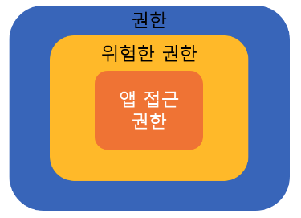

OS 6.0이상, 미만으로 권한 여부가 나뉘지만 OS 6.0이상으로만 정리

# 권한이란?

- 앱 서비스 제공자는 해당 서비스를 제공하기 위하여 이용자의 스마트폰 내의 정보 및 기능에 대한 접근권한이 필요한 경우,

1. 필수적 접근권한과 선택적 접근권한을 구분하여,
2. 접근권한이 필요한 항목 및 그 이유 등을 이용자에게 명확하게 알리고,
3. 접근권한에 대한 이용자의 동의를 받아야 함

- 앱 서비스 제공자는 이용자가 선택적 접근권한에 동의하지 않는다는 이유로 이용자에게 해당 서비스의 제공을 거부해서는 안 됨

# 안드로이드 권한의종류

약 140가지 이상  
https://developer.android.com/reference/android/Manifest.permission

# 권한의 종류

- 위험한 권한(런타임 권한)
  - 필수 권한
  - 선택적 권한
- 일반 권한

## 위험한 권한

[{: width="30%" height="30%"}](../../../assets/images/study/android/ScreenShot 2023-12-20 9.07.15.png)
앱이 이용자의 개인 정보를 포함하거나 이용자의 저장된 데이터나 다른 앱의 작업에 영향을 미칠 수 있는 데이터나 리소스를 필요로 하는 권한입니다.

## 필수 권한

- 사용자가 권한 접근에 동의하지 않으면 해당 서비스의 이용이 제한될 수 있다.
- 일반적으로 앱 최초 실행시 동의를 구함

## 선택적 권한

- 사용자가 선택에 따라 접근 권한을 동의하지 않을 수 있으며, 이용자가 동의하지 않더라도 앱을 이용할 수 있습니다.
- 일반적으로 해당 기능을 이용할 때 동의를 구함
- 선택적 접근 권한만 있다면 최초 실행 화면이 아닌 해당 정보와 기능에 최초에 접근할 때 고지해도 상관없다.

## 일반권한
- 낮은 수준의 보호 권한으로써 App 사용자(User)에게 권한 부여 요청을 필요로 하지 않고 App 설치 시 자동으로 권한을 부여 받는다.
- ex) INTERNET, BLUETOOTH, VIBRATE, SET_ALARM

---
참고  
[1] https://developer.android.com/reference/android/Manifest.permission  
[2] https://developer.android.com/training/permissions/requesting?hl=ko