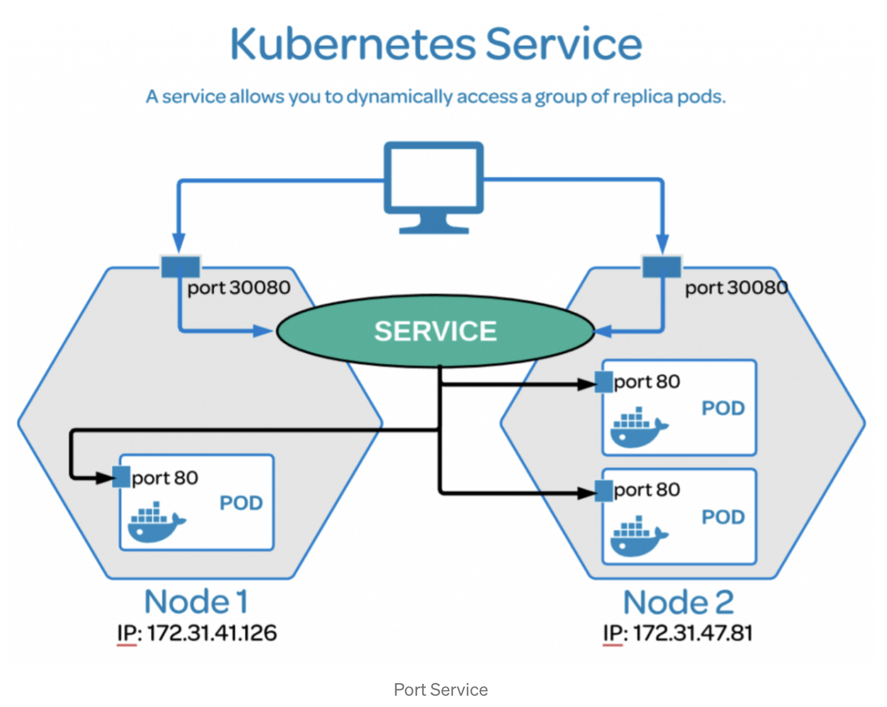

<a href="../../../../assets/images/study/infra/kubernets/image.png">
  
</a>

# [k8s] service

## selector
- Service를 생성하면, label Selector에서 특정 label을 가진 Pod들만 탐지한다. Service는 이렇게 필터된 Pod의 IP들을 엔드포인트로 묶어 관리하게 된다. 그래서 하나의 Service를 통해 여러 Pod에 로드밸런싱이 이루어질 수 있는 것이다.

## nodePort

- 이는 서비스가 쿠버네티스 클러스터 외부에서 노드의 IP 주소와 이 속성에 정의된 포트로 보일수 있도록 한다.   
  이 때, 서비스는 type: NodePort로 지정해야 한다 이 필드는 정의되어 있지 않을 경우 쿠버네티스가 자동으로 할당한다.
- 쿠버네티스에 요청할 포트번호 ( ex) 192.~~~:30080 )

## port

- 서비스를 클러스터 안에서 지정된 포트를 통해 내부적으로 노출한다.  
  즉, 서비스는 이 포트에 대해서 보일 수 있게 되며 이 포트로 보내진 요청은 서비스에 의해 선택된 파드로 전달된다.

## targetPort

- 이 포트는 파드로 전달되는 요청이 도달하는 포트이다.  
  서비스가 동작하기 위해서는 애플리케이션이 이 포트에 대해 네트워크 요청을 listening을 하고 있어야 한다.

## type

### clusterIP

- 러스터 내부에서만 접근 가능하며, 외부 트래픽을 직접 처리하지 않습니다. 주로 내부 서비스 간 통신에 사용됩니다.
- Ingress와 함께 사용될 때, Ingress Controller가 내부적으로 ClusterIP 서비스를 통해 트래픽을 라우팅하므로 외부에 NodePort를 노출할 필요가 없습니다.
- 클러스터는 모든 노드와 애플리케이션을 포함하는 전체 환경이고, ClusterIP는 그 클러스터 내에서 서비스 간의 통신을 가능하게 하는 네트워킹 메커니즘

### nodePort

클러스터의 각 노드에 고정된 포트를 열어 외부에서 직접 접근할 수 있도록 합니다. 클라우드 외부 환경이나 자체 로드 밸런서를 설정하지 않은 온프레미스 환경에서 유용합니다.

## 스터노드, 워커노드가 나뉘어져있을 때 외부에서 어떤아이피:노드포트로 접속해야 하는가? 파드가 속해있는 워커노드는 계속 바뀔 수도 있지 않는가?

- 마스터 노드: 192.168.1.10
- 워커 노드 1: 192.168.1.11
- 워커 노드 2: 192.168.1.12

```
http://192.168.1.10:30007
http://192.168.1.11:30007
http://192.168.1.12:30007
```

- 동적 파드 스케줄링과 무관함: 파드가 특정 워커 노드에 스케줄링되더라도, NodePort는 클러스터 내 모든 노드에서 서비스를 접근할 수 있게 해주므로, 특정 노드에 파드가 위치하든 다른 노드에 위치하든 외부
  접근에는 영향이 없습니다.

### 워커 노드의 동적 변경 시 고려사항
- 노드 추가/제거: 클러스터에 새로운 노드가 추가되거나 기존 노드가 제거되더라도, NodePort는 자동으로 해당 노드에서도 서비스 포트를 열기 때문에, 추가된 노드의 IP와 기존 노드들의 IP를 통해 접근이 가능합니다. 
- 노드 IP 변경: 만약 노드의 IP가 변경되는 경우(예: 클라우드 환경에서 동적으로 IP가 할당되는 경우), 외부 접근 설정을 업데이트해야 합니다. 이를 방지하기 위해 고정 IP를 사용하거나, 클러스터 앞에 로드 밸런서를 두는 것이 좋습니다.
- 워커 노드의 IP가 변경되더라도 마스터 노드의 IP와 NodePort를 통해 서비스에 지속적으로 접근할 수 있습니다. 

---  
참고  
[1] https://kimmj.github.io/kubernetes/port-targetport-nodeport-in-kubernetes/  
[2] chatGPT  
[3] https://velog.io/@pinion7/Kubernetes-%EB%A6%AC%EC%86%8C%EC%8A%A4-Service%EC%97%90-%EB%8C%80%ED%95%B4-%EC%9D%B4%ED%95%B4%ED%95%98%EA%B3%A0-%EC%8B%A4%EC%8A%B5%ED%95%B4%EB%B3%B4%EA%B8%B0
