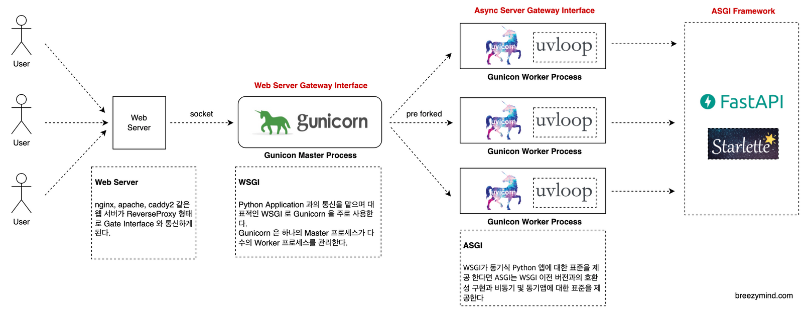

# Fastapi와 gunicorn 도식도

- python 웹서비스 아키텍처
  {: width="100%" height="100%"}

# Web server

### 역할

- 정적 요청에 대한 응답
- Reverse Proxy를 이용하여 어플리케이션 서버로 동적인 요청을 전달

# WSGI, ASGI

## WSGI(Web Server Gateway Interface) - unvicorn

- Python 웹 애플리케이션과 웹 서버 간의 동기적 통신
- 요청당 하나의 스레드 또는 프로세스를 사용
- FastAPI는 내부적으로 Uvicorn이라는 ASGI 서버를 사용하여 단독으로 실행될 수 있다.

## fastapi 실행 방법

```cmd
python.exe -m uvicorn main:app --reload
```

## fastapi 실행 방법 2

- 위 직접 실행의 경우 디버깅이 불가능 하기 때문에 main 함수에 uvicorn을 호출하여 실행하는 방법

```python
if __name__ == "__main__":
    uvicorn.run(app, host="0.0.0.0", port=8000)
```

```cmd
python ./main.py
```

## ASGI(Asynchronous Server Gateway Interface) - gunicorn

- Python 웹 애플리케이션과 웹 서버 간의 비동기적 통신
- 동시에 여러 요청을 처리할 수 있는 비동기적 모델
- gunicorn은 프로세스 매니저로서 동작하게 된다. 프로세스 매니저로서 Master 프로세스를 띄우고 Worker 프로세스로, 단일 프로세스로 실행하는 uvicorn  (uvicorn 에는 Gunicorn-호환
  worker class 가 존재한다) 프로세스를 여러개 미리 띄워 요청을 처리하는 구조
- Gunicorn은 WSGI 서버이지만, uvicorn.workers.UvicornWorker를 사용하여 ASGI 애플리케이션인 FastAPI를 호스팅할 수 있습니다. 이를 통해 FastAPI 애플리케이션을 여러
  워커 프로세스에서 실행하여 처리 능력을 확장할 수 있다.

---
참고  
[1] https://breezymind.com/start-asgi-framework/  
[2] ChatCPT 4
