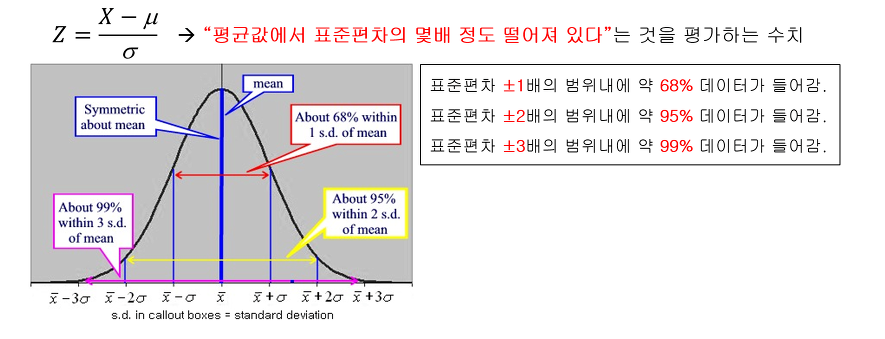

# 분위수

- 확률 p에 위치해있는 수가 어떤수인지를 구하는 방법

```ex)
24, 28, 37, 43, 46
x1, x2, x3, x4, x5 
```

일때 p가 0.5인 경우의 분위수 값은? 5개 x 0.5 = 2.5 -> 2.5번째의 데이터 -> 2.5값은 없으므로 인접한 자연수로 만들어 준다 -> 올림

# z-scoring

- 자료가 평균으로부터 표준편차의 몇 배만큼 떨어져 있는지를 나타낸다
<a href="../../../assets/images/study/statistics/img.png">
  
</a>
- 위 그림은 표준 정규 분포에서의 분포 모형이다.
- 위 그림에서 Z의 절대값이 3 이상이 나온다면 좀 튀는 값이라고 생각 할 수 있다.

# t - test
- 두 집단의 평균 차이를 통계적으로 차이가 있는지 검정하기 위한 방법.
- 두 집단의 평균이 얼마나 차이가 있는지 통계적으로 확인하는 test
- t : 그룹 간 차이에 비례하는 값..
- t : 표본 평균 차이 / 불확실도 
- 독립변수, 종속변수가 있음
  - 독립 변수 : 정석적 변수(집단) : 명목, 서열 -> 성별
  - 종속 변수 : 분석 대상이 되는 종류인 정량적 변수 : 등간, 비율 -> 수분 섭취량
- t값으로 유의확률이 나오게 된다.
- 


ex)
대한민국 20대 남녀 키비교
여자 키 30명 vs 남자 키 30명


---
참고  
[1] https://www.youtube.com/watch?v=p5Nfm3vQWVQ&ab_channel=%ED%86%B5%EA%B3%84%EC%9D%98%EB%B3%B8%EC%A7%88EOStatistics  
[2] https://drhongdatanote.tistory.com/50  
[3] https://www.youtube.com/watch?v=mQXj456SWco&ab_channel=%EA%B3%B5%EB%8F%8C%EC%9D%B4%EC%9D%98%EC%88%98%ED%95%99%EC%A0%95%EB%A6%AC%EB%85%B8%ED%8A%B8  
[4] https://www.youtube.com/watch?v=k1-GLghpt_o&ab_channel=%EB%93%9C%EB%A6%BC%EC%85%80%ED%8C%8C%28%EB%85%BC%EB%AC%B8%EC%BB%A8%EC%84%A4%ED%8C%851%3A1%EB%A7%9E%EC%B6%A4%29