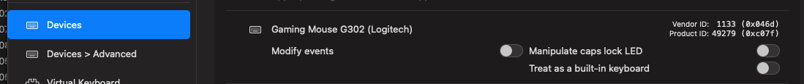

# [tips] logitech mouse g hub inactive problem

## 원인1

로지텍 G 허브에서 비활성화 문제가 발생하는 이유는 karabiner때문이다.  
karabiner에서 인식을 먼저 가져가기 때문에 g hub에서 비활성화 현상이 발생한다.

그림처럼 modify events를 비활성화 시켜준다.

## 원인2

종료했거나 스위치를 꺼도 안된다면  
맥 설정 > 개인정보 보호 및 보안 > 입력 모니터링에
G HUB 스위치가 꺼져있을것이다 ON 해주자!