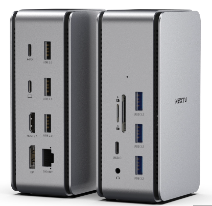

# [tips] 허브 vs 독 차이, nextu 1401-ds 도킹(독)스테이션 구매 후기

mac m1 pro를 구매 후 집에 있는 랜선, hdmi모니터, 기계식 키보드, 마우스 등을 1개의 허브로 연결했었다.  
허브 하나로 모든걸 연결할 수 있을 줄 알았는데 그렇지 않았다. 랜선의 인터넷 연결이 자꾸 끊기는 현상이 발생했다.  
찾아 보니 허브에는 노트북으로 데이터를 전송할 수 있는 최대 대역폭이란게 존재했고, 그 대역폭이 4k, 30hz 모니터 하나만 연결해도 6.2Gbps의 최소 대역폭이 필요하였다.  
알아 본 바로 허브, 독이라는 연결장치가 존재해서 차이를 기록하고 알아본 도킹 스테이션들을 소개해드리겠습니다!  

## 허브 vs 독

### 허브
- 다양한 포트들이 존재
- 대역폭이 적어서 여러개의 장비를 한개의 허브에 꽂아서 사용하면 끊김현상 발생
- 노트북의 전원을 활용함

### 독
- 별도의 전원 공급
- 썬더볼트4 기준 40Gbps의 대역폭을 가지고 있어서 4K(3840 x 2160) 60Hz의 최소 필요 대역폭인 12.5Gbps를 사용하고도 대역폭 충분

큰 차이는 이정도가 있고 벨킨에서 최근에 출시한 ``7in1 USB C타입 멀티 허브 INC009bt``제품도 최대 대역폭이 10Gbps이다.

## 도킹스테이션 리스트
### Caldigit TS4
- 필요한 포트 전부존재
- 인기가 가장 많지만 제일 비쌈
- 전원 어댑터 있음
- 단점 : HDMI포트가 없음, 안예쁨
- 60만원대

### Caldigit 소호독
- 컴팩트한 독
- 단점 : 랜포트 없음
- 전원 어댑터 없이 패스스루(c타입 pd포트를 통한 노트북외 기타 기기 충전)
- 10만원대

### 벨킨 썬더볼트4 독
- 필요한 포트 전부 존재
- 전원 어댑터 있음
- 예쁨
- 단점 : 없음
- 40만원대

### 사테치 썬더볼트4 독
- 필요한 포트 전부 존재
- 전원 어댑터 있음
- 예쁨
- 위 제품들 중에 가장 가격대가 합리적임
- 30만원대

### nextu 1401-ds 썬더볼트4 독
- 필요한 포트 전부 존재
- 전원 어댑터 없이 패스스루(c타입 pd포트를 통한 노트북외 기타 기기 충전)
- 단점 : 안예쁨
- 20만원대
  

집에서 작업 할 일이 그렇게 많지는 않기 때문에 위 리스트중 가장 가격이 저렴한 nextu제품을 구매했다.  
구매 하면서 계속 드는 궁금증이  
- 전원 어댑터가 없으면 다른 제품들에 비해 안정성이 떨어지지 않을까? 
- 패스스루 충전 포트에 전원을 연결하면 별도의 전원 어댑터처럼 작동을 하는것인가?  
해당 사항과 기타 상품 리뷰는 실 사용 후 적어보도록 하겠습니다!