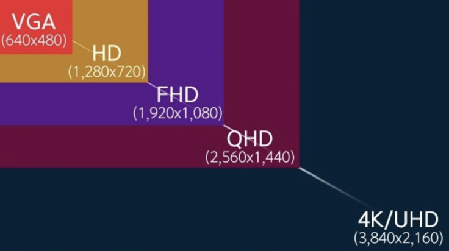

# 화소란?
- 총 픽셀을 뜻하며 가로x세로 값
- FHD 화소수는 1920x1080=2,073,600화소수 = 약 200만화소

# UHD
- Ultra High Definition
- 4K
    - 가로 픽셀 수를 반올림 한 수
- 3840x2160

<!-- {: width="50%" height="50%"}   -->

# FHD
- 1920x1080

# HDR vs IPS
## HDR
- 소프트웨어 기술
- High Dynamic Range
- 이미지의 밝은 영역과 어두운 영역이 더 쉽게 구분됩니다. 향상된 밝기 및 더 어두운 검정 수준을 활용하므로 더 높은 대비의 이미지를 생산할 수 있습니다.

## IPS
- 하드웨어 기술
- In Panel Switching
- LED 디스플레이의 하위 부분
- VA 패널 디스플레이 및 TN 패널 디스플레이에 비해 더 나은 화질을 제공

# 모니터 주사율
60hz는 초당 60장의 사진을 보여주는 것이고 144hz는 초당 144장의 사진을 보여주는 것이다.

# 32 인치 모니터

## 델 레노버 l32p
- 가격대 : 45 ~ 50
- 최대 해상도 : 3840x2160(4K UHD)
- 최대 주사율 : 60Hz 
- IPS

## LG 32un880 
- 70 ~ 80
- 최대 해상도 : 3840x2160(4K UHD)
- 최대 주사율 : 60Hz 
- IPS
- 모니터암
- c타입 지원

## LG 32un650
- 50 ~ 60
- 3840x2160(4K UHD)
- 최대 주사율 : 60Hz
- IPS 

## LG 32GN650 
- 40~50
- 게이밍 모니터
- 2560 x 1440(QHD)
- 최대 주사율 : 165HZ
- VA

## 삼성 M7
- 30~40
- 3840x2160(4K UHD)
- 최대 주사율 : 60Hz
- VA 

## 삼성 오디세이 G5
- 40~50
- 게이밍 모니터
- 2560 x 1440(QHD)
- 최대주사율 : 144Hz
- VA

참조  
[1] https://m.blog.naver.com/yuri8097/221118457430  
[2] https://www.intel.co.kr/content/www/kr/ko/gaming/resources/hdr-gaming-monitor-guide.html
