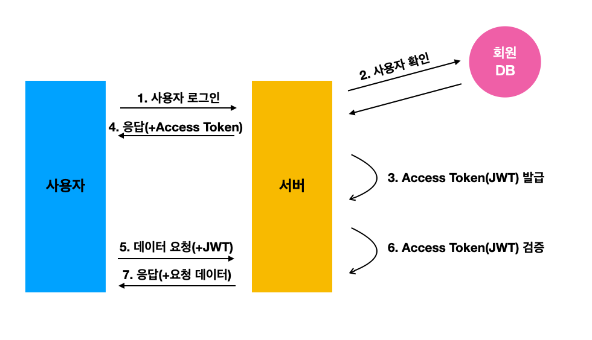

# 토큰 vs 세션

## 세션
- 서버에서 사용자가 로그인 중임을 기억하고 있는 시스템
- 메모리, 디스크, 디비 등에 저장 (주로 메모리)

{: width="100%" height="100%"}

### 로직
1. 사용자 로그인
2. 사용자 정보 조회
3. 세션 id 발급
4. 클라이언트에선 주로 브라우저 쿠키에 저장
5. 사용자 요청시 서버는 세션 저장소에서 세션을 조회 한 후 정상 세션일 경우에만 응답 처리

### 단점
- 서버 확장시 번거로워짐
- 모놀리식 환경이 아닌 MSA 환경에서는 모든 서버끼리 같은 세션을 공유해야 함

## 토큰
- 로그인 이후 서버가 만들어 주는 문자열
- 문자열 안에는 사용자의 로그인 정보(DB의 사용자 인덱스, 닉네임)가 들어있음
- 해당 정보가 서버에서 발급되었음을 증명하는 서명이 들어있음

{: width="100%" height="100%"}

### 로직
1. 사용자 로그인
2. 서버에서 사용자에게 쿠키를 통해 토큰 발급
3. 클라이언트에서 다른 API 요청시 발급받은 토큰과 함께 요청
4. 서버에서 토큰 유효성 검증 및 처리

### 장점
- 클라이언트에서 로그인 상태를 지닌 토큰을 가지고 있음 = 서버 리소스 적음
- 그러므로 로그인 상태를 공유하고 있을 필요가 없기 때문에 서버 확장에 용이

### 간단한 실습

#### 비밀키 생성
```shell
openssl rand -hex 64
```
위 명령어를 통해 발급받은 랜덤 문자열을 env파일에 추가한다.
```env
JWT_SECRET = 23213123213~~~
```
이제 비밀 정보가 들어있으므로 env파일은 절대 외부로 공유돼서는 안된다.

#### 로그인(server)

```javascript
// node.js
import bcrypt from 'bcrypt';
import jwt from 'jsonwebtoken';
UserSchema.methods.generateToken = function() {
  const token = jwt.sign(
    // 첫번째 파라미터엔 토큰 안에 집어넣고 싶은 데이터를 넣습니다
    {
      _id: this.id,
      username: this.username,
    },
    process.env.JWT_SECRET, // 두번째 파라미터에는 JWT 암호를 넣습니다
    {
      expiresIn: '7d', // 7일동안 유효함
    },
  );
  return token;
};

```

```javascript
// # node.js middelware
import jwt from 'jsonwebtoken';
import User from '../models/user';

const jwtMiddleware = async (ctx, next) => {
  const token = ctx.cookies.get('access_token');
  if (!token) return next(); // 토큰이 없음
  try {
    const decoded = jwt.verify(token, process.env.JWT_SECRET);
    ctx.state.user = {
      _id: decoded._id,
      username: decoded.username,
    };
    // 토큰 3.5일 미만 남으면 재발급
    const now = Math.floor(Date.now() / 1000);
    if (decoded.exp - now < 60 * 60 * 24 * 3.5) {
      const user = await User.findById(decoded._id);
      const token = user.generateToken();
      ctx.cookies.set('access_token', token, {
        maxAge: 1000 * 60 * 60 * 24 * 7, // 7일
        httpOnly: true,
      });
    }

    return next();
  } catch (e) {
    // 토큰 검증 실패
    return next();
  }
};

export default jwtMiddleware;

```

```javascript
// # node.js login
import Joi from 'joi';

const user = await User.findByUsername(username);
// 계정이 존재하지 않으면 에러 처리
if (!user) {
  ctx.status = 401;
  return;
}
const valid = await user.checkPassword(password);
// 잘못된 비밀번호
if (!valid) {
  ctx.status = 401;
  return;
}
ctx.body = user.serialize();
const token = user.generateToken();
ctx.cookies.set('access_token', token, {
  maxAge: 1000 * 60 * 60 * 24 * 7, // 7일
  httpOnly: true,
});

/*
  GET /api/auth/check
  서버측 토큰 검증이 끝난 context state에 user값이 정상적으로 존재하는지 확인하는 함수
*/
export const check = async (ctx) => {
  const { user } = ctx.state;
  if (!user) {
    // 로그인중 아님
    ctx.status = 401; // Unauthorized
    return;
  }
  ctx.body = user;
};
```

#### 코드 로직(로그인 프로세스)
1. 로그인 
2. user값과 토큰 리턴
3. 리덕스 auth에 user값 json 저장
```json
{
  "_id": "~~",
  "username": "~~",
  "__v": 0
}
```
4. 클라이언트에서 check api를 통해 토큰 검증
5. 리덕스 user에 check api 반환값 json 저장
```json
{
"_id": "~~",
"username": "~~"
}
```


 


참고  
[1] 리액트를 다루는 기술  
[2] https://velog.io/@kingth/%EC%84%9C%EB%B2%84-%EC%9D%B8%EC%A6%9D-%EB%B0%A9%EC%8B%9D%EC%84%B8%EC%85%98%EC%BF%A0%ED%82%A4-%ED%86%A0%ED%81%B0